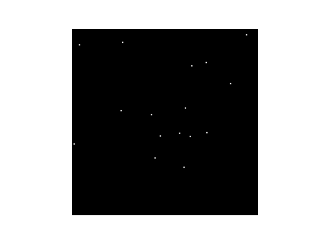

# Star Tracker Simulator 

Generate truth data for star trackers on the ground to test centroiding, identification, and Wahba's Problem solvers!

Simulated Image with quaternion: [-0.039, 0.304, 0.920, -0.243]; scalar last form; 4.5 magnitude threshold.
## The Big Dipper!

