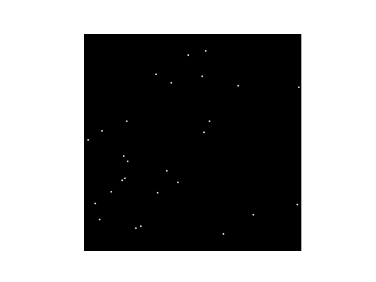

# Star Tracker Simulator 

Generate truth data for star trackers on the ground to test centroiding, identification, and Wahba's Problem solvers!

Simulated Image with quaternion: [0.014, 0.233, 0.971, -0.051]; scalar last form; 5.5 magnitude threshold 

